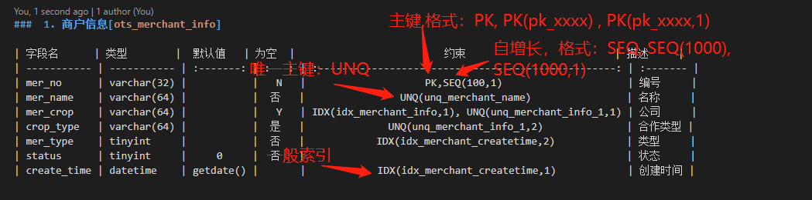

# gluecli
通过工具生成glue 项目结构代码

## 生成数据库

标签说明

###  1. 商户信息[ots_merchant_info]
	
| 字段名      | 类型        |  默认值   | 为空  |                         约束                         | 描述     |
| ----------- | ----------- | :-------: | :---: | :--------------------------------------------------: | :------- |
| mer_no      | varchar(32) |           |   N   |                    PK,SEQ(100,1)                     | 编号     |
| mer_name    | varchar(64) |           |  否   |                UNQ(unq_merchant_name)                | 名称     |
| mer_crop    | varchar(64) |           |   Y   | IDX(idx_merchant_info,1), UNQ(unq_merchant_info_1,1) | 公司     |
| crop_type   | varchar(64) |           |  是   |              UNQ(unq_merchant_info_1,2)              | 合作类型 |
| mer_type    | tinyint     |           |  否   |            IDX(idx_merchant_createtime,2)            | 类型     |
| status      | tinyint     |     0     |  否   |                                                      | 状态     |
| create_time | datetime    | getdate() |       |            IDX(idx_merchant_createtime,1)            | 创建时间 |

 

